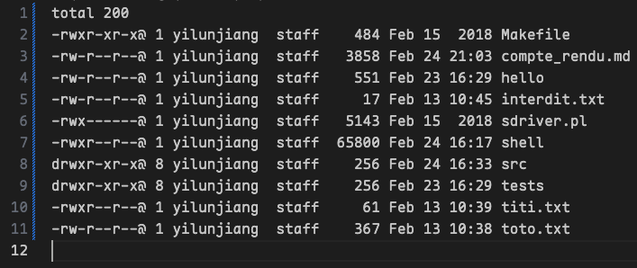

# Compte Rendu Réalisation d’un mini-shell

<p align="right">NI Yuzhen, JIANG Yilun</p>

# Les principales

## Commande pour terminer le shell

Pour implémenter la commande `quit`, on déterminer la commande en utilisant `strcmp`

```c
if (strcmp(cmd[0], "quit") == 0)
{
  printf(" je vais quitter");
  exit(0);
}
```

Le programme va quitter avec `exit(0)`

## Interprétation de commande simple

On lit la commande située dans `l->seq[]`, et puis on la passe dans la fonction `exec`. On vérifie si le résultat est égale a `-1`, si oui alors on termine le processus et retourne une error.

```c
if (execvp(cmd[0], cmd) == -1)
{
  perror("execvp error");
  exit(1);
}
```

## Commande simple avec redirection d’entrée ou de sortie

Ici on ouvert `l->in` ou `l->out` et on lui met dans l'entrée `STDIN` ou `STDOUT`avec la fonction `Dup2()`

```c
if (l->in) // redirection de l'entree standard
{
  int fd = open(l->in, O_RDONLY, 0644);
  if (fd < 0)
  {
    perror("Error opening input file");
    exit(1);
  }
  Dup2(fd, STDIN_FILENO);
  close(fd);
}
```

```c
if (l->out) // redirection de la sortie standard
{
  int fd = open(l->out, O_WRONLY | O_CREAT, 0644);
  if (fd < 0)
  {
    perror("Error opening output file");
    exit(1);
  }
  Dup2(fd, STDOUT_FILENO);
  close(fd);
}
```

## Gestion des erreurs

Si on rencontre une erreur, la fonction `execvp` va afficher cette erreur; et le programme va executer la commande suivante;

Si le programme ne trouve pas la commande, la fonction `execvp` va retourner `-1`, et puis la programme va afficher l'erreur `commande not found`

```c
if (execvp(cmd[0], cmd) == -1)
{
  printf("commande not found %s\n", cmd[0]);
  exit(1);
}
```

## Séquence de commandes composée de deux commandes reliées par un / plusieur tube(s)

Pour gerer les commandes qui s'exécutent dans un `pipe`, nous utilisons un tableau de deux dimensions pour mettre les commandes dans une sequence(ligne : les commandes différents, colonne: `STDIN`, `STDOUT`, `STDERR`.)

 À chaque itération, le programme lit les commandes et redirecte l'entrée standard de la commande suivante vers le résultat de la commande courante. 

```c
int pipefd[nb_cmd - 1][2];

if (i > 0) // detecter si il est pas le premier commande
{
  int in_pipe = pipefd[i - 1][0];
  Dup2(in_pipe, STDIN_FILENO);
  Close(pipefd[i - 1][0]);
}

if (i < nb_cmd - 1) // détecter si il est pas le dernier commande
{
  int out_pipe = pipefd[i][1];
  Dup2(out_pipe, STDOUT_FILENO);
  Close(pipefd[i][1]);
}

// Fermer tous les pipes en cas de mauvaise gestion
for (j = 0; j < nb_cmd - 1; j++)
{
  close(pipefd[j][0]);
  close(pipefd[j][1]);
}
```


À la fin de chaque itération, on va fermer tous les pipes pour éviter les erreurs.


## Exécution de commandes en arrière-plan et gestion des zombis

On peut mettre `&` dans le queue d'une ligne de commande pour que celle-ci marche dans l'arrière-plan. Le traitant de `SIGCHILD` sert à consommer toutes les commandes dans l'arrière-plan afin d'eviter la zone de zombie. Le jeu de testes, incluant les commandes simples et compliquées, est fourni pour tester notre shell. 

```c
void sigchld_handler(int sig) {
    while (waitpid(-1, NULL, WNOHANG) > 0);
}

signal(SIGCHLD, sigchld_handler);
```

```c
if (strcmp(l->seq[nb_cmd - 1][lastChar - 1], "&") == 0) // Déterminer si lea symbol & est à la fin de la ligne de la commande
{
  background = 1;
  l->seq[nb_cmd - 1][lastChar - 1] = NULL;
}

// On n'attends que les programmes qui ne marche pas dans l'arrière plan
for (i = 0; i < nb_cmd; i++)
{
  if (!background)
  { //executer le wait lorsqu'il n'y a pas d'indication de &
    int status;
    waitpid(pids[i], &status, 0);
    if (WIFEXITED(status) && WEXITSTATUS(status) != 0)
    {
      printf("Command failed with status %d\n", WEXITSTATUS(status));
    }
  }
}
```

# Les Tests

## 1. Tests sur les entrées et les sorties standard

### Sortie standard

```shell
shell> ls -l > toto.txt
out: toto.txt
seq[0]: ls -l
```

Screenshot de `toto.txt`



### Entrée standard

```shell
shell> wc -c < toto.txt
in: toto.txt
seq[0]: wc -c 
     619
```

### Entrée et strtie standard

```shell
shell> wc -c < toto.txt > titi.txt
in: toto.txt
out: titi.txt
seq[0]: wc -c
```

Screenshot de `titi.txt`


## 2. Test de gestion des erreurs

### Test sur les erreurs de permission

On a un ficher en lecture seul par utilisateur:

```shell
-r--------@ 1 yilunjiang  staff     17 Feb 24 21:11 interdit.txt
```

```shell
shell> ls -l > interdit.txt
out: interdit.txt
seq[0]: ls -l 
Error opening output file: Permission denied
```

### Teste sur de mauvaises commandes

```shell
shell> dsadadasdasd
seq[0]: dsadadasdasd 
seq[0]: commande not found dsadadasdasd
```

La symbole `&` n'est pas à la fin de la ligne de commande:

```shell
shell> ls -l | grep Makefile & | wc -c
seq[0]: ls -l 
seq[1]: Error: & must be at the end of the command
```

## 3. Test sur des multiples pipes

```shell
shell> ls -l | grep Makefile | wc -c  
seq[0]: ls -l 
seq[1]: grep Makefile 
seq[2]: wc -c 
      61
```

```shell
shell> ls -l | grep Makefile
seq[0]: ls -l 
seq[1]: grep Makefile 
-rwxr-xr-x@ 1 yilunjiang  staff    484 Feb 15  2018 Makefile
```

## 4. Test sur

### Exemple sans gestion des zombie

Ici, on peut trouver des processus qui marche dans l'arrière plan: la processus `48857` et la processus `48858`

```shell
shell> ls -l | wc -c &
seq[0]: [48857] ls running in background
ls -l 
seq[1]: [48858] wc running in background
wc -c 
shell>      691

shell> ps -ax 48857
seq[0]: ps -ax 48857 
  PID TTY           TIME CMD
48857 ttys007    0:00.00 <defunct>
shell> ps -ax | grep 48858
seq[0]: ps -ax 
seq[1]: grep 48858 
48858 ttys007    0:00.00 <defunct>
48996 ttys007    0:00.00 grep 48858
```

### Exemple avec gestion des zombie

Ici, on trouve pas de processus dans la zone zombie

```shell
shell> ls -l | wc -c &
seq[0]: [47937] ls running in background
ls -l 
seq[1]: [47938] wc running in background
wc -c 
shell>      691

shell> ps -ax | grep 47937
seq[0]: ps -ax 
seq[1]: grep 47937 
48045 ttys007    0:00.00 grep 47937
shell> ps -ax | grep 47938
seq[0]: ps -ax 
seq[1]: grep 47938 
48153 ttys007    0:00.00 grep 47938
```

